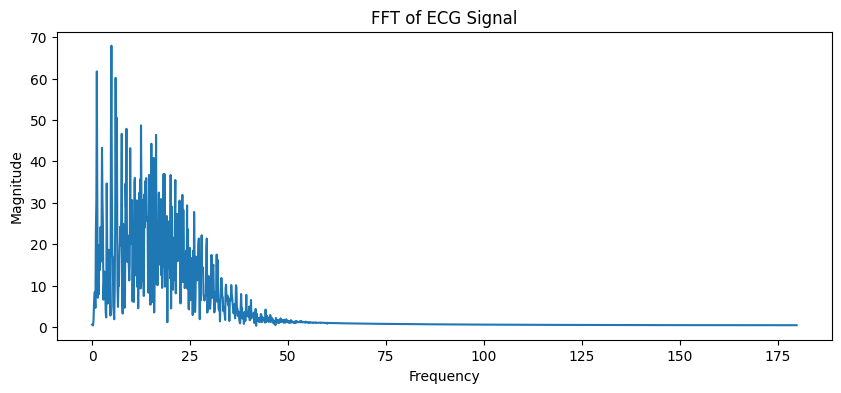

# ECG Signal Processing and Heart Rate Analysis

## Overview
This project focuses on preprocessing and analyzing ECG (Electrocardiogram) waveform data using Python-based digital signal processing techniques. The workflow includes ECG signal acquisition, filtering, denoising, FFT analysis, and R-peak detection for heart-rate estimation.

The project was developed to explore biomedical signal processing concepts such as waveform analysis, feature extraction, noise reduction, and physiological time-series interpretation.

---

## Features
- ECG waveform visualization
- Butterworth bandpass filtering
- Noise and baseline drift removal
- FFT-based frequency-domain analysis
- R-peak detection
- Heart-rate estimation
- Biomedical waveform preprocessing

---

## Technologies Used
- Python
- NumPy
- Pandas
- SciPy
- Matplotlib
- NeuroKit2
- WFDB

---

## Dataset
MIT-BIH Arrhythmia Database

Source:
https://physionet.org/content/mitdb/1.0.0/

---

## Signal Processing Workflow

### 1. Raw ECG Acquisition
ECG waveform data is loaded from the MIT-BIH Arrhythmia dataset using the WFDB library.

### 2. Signal Preprocessing
A Butterworth bandpass filter is applied to:
- Remove baseline wander
- Suppress motion artifacts
- Reduce high-frequency noise

### 3. R-Peak Detection
R-peaks are detected using NeuroKit2 ECG processing functions for accurate heart-rate estimation.

### 4. FFT Analysis
Fast Fourier Transform (FFT) is used to analyze ECG signal frequency characteristics.

### 5. Feature Extraction
Important waveform features and physiological information are extracted from the processed ECG signal.

---

## Results
The preprocessing pipeline improved ECG signal clarity and enabled reliable heartbeat detection and waveform analysis.

---

## Output Visualizations

### Raw ECG Signal


### Filtered ECG Signal


### FFT Analysis


### R-Peak Detection


---

## Installation

Install dependencies:

```bash
pip install -r requirements.txt
```

---

## Run the Project

Run the Jupyter Notebook:

```bash
jupyter notebook ECG_Analysis.ipynb
```

---

## Future Improvements
- Wavelet denoising
- Signal Quality Index (SQI)
- Arrhythmia classification
- Motion artifact detection
- Real-time ECG streaming

---

## Author
Shivaraman T
